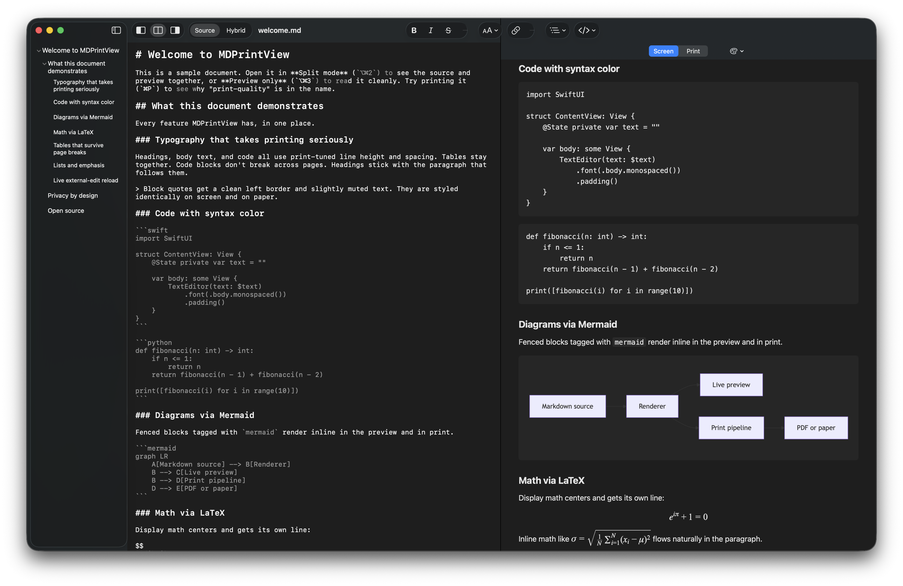

<div align="center">

# MDPrintView

A native macOS markdown editor with print-quality typography.

[](LICENSE)
[](https://www.apple.com/macos/)
[](https://github.com/neomavkda3/MDPrintView/releases/latest)

### [⬇️ Download MDPrintView for Mac](https://github.com/neomavkda3/MDPrintView/releases/latest)

</div>



---

MDPrintView is a markdown editor that takes printing seriously. Three pane modes (Editor / Split / Preview), four reading themes, native macOS text editing, Mermaid diagrams, LaTeX math, and a print pipeline that keeps headings, code blocks, and tables together across page breaks.

## Install

### Quick install (for anyone)

1. Click **[⬇️ Download MDPrintView for Mac](https://github.com/neomavkda3/MDPrintView/releases/latest)** and on the page that opens, download the file ending in `.dmg` (under **Assets**).
2. **Double-click** the downloaded file. A small window will open showing the MDPrintView app icon.
3. **Drag the MDPrintView icon into the Applications folder** (the window includes a shortcut to Applications).
4. Open MDPrintView from **Launchpad** or your **Applications** folder.

The first time you open it, macOS may take a moment to verify the app is from a known developer. This is normal and won't happen again. **There will be no "unidentified developer" warning**: the app is signed and notarized by Apple.

MDPrintView checks for new versions automatically once a day, and you can check anytime from the menu bar at **MDPrintView → Check for Updates…**.

### Homebrew Cask (coming later)

Planned after a few stable point releases, once the install flow has real-world miles:

```sh
brew install --cask mdprintview
```

## What it does

- **Three layout modes**: Editor, Split, Preview-only. Switch with `⌥⌘1` / `⌥⌘2` / `⌥⌘3`
- **Four reading themes**: Original, Focus, Sepia, Print
- **Live external-edit reload**: edit the file from another tool (vim, Claude Code, VS Code) and MDPrintView updates in place
- **Mermaid diagrams + LaTeX math**: KaTeX (display via `$$...$$`, inline via `\(...\)`)
- **Print-quality output**: page breaks respect headings, code, and tables
- **PDF export**: `⌘⇧E`
- **Eleven editor fonts** plus full system font picker via the standard Fonts panel
- **System / Light / Dark appearance**: overrides macOS preference per-app
- **Welcome screen**: recent + pinned documents with search and content previews
- **Document tabs**: multiple files cluster as tabs in a single window
- **Privacy-first**: zero network calls, sandbox-ready, Privacy Manifest declared

## Requirements

- macOS 26.0 (Tahoe) or later
- Apple Silicon or Intel Mac

## Keyboard shortcuts

> macOS keyboard symbols: `⌘` = Command, `⌥` = Option, `⇧` = Shift

| Shortcut | Action |
|---|---|
| `⌘N` / `⌘O` | New / Open document |
| `⌘B` / `⌘I` | Bold / Italic |
| `⌘1` `⌘2` `⌘3` | Heading 1 / 2 / 3 |
| `⌘K` | Insert link |
| `⌘F` / `⌘G` / `⌘⇧G` | Find / Find Next / Find Previous |
| `⌘;` / `⌘:` | Check Document Now / Show Spelling and Grammar |
| `⌘⇧M` | Mermaid editor |
| `⌘P` / `⌘⇧E` | Print preview / Export PDF |
| `⌥⌘1` `⌥⌘2` `⌥⌘3` | Editor only / Split / Preview only |
| `⌘,` | Settings |

## For developers

### Build from source

```sh
brew install xcodegen
git clone https://github.com/neomavkda3/MDPrintView.git
cd MDPrintView
xcodegen generate
xcodebuild -project MDPrintView.xcodeproj -scheme MDPrintView -configuration Debug build
```

Full contributor build notes in [CONTRIBUTING.md](CONTRIBUTING.md). Architecture overview in [docs/ARCHITECTURE.md](docs/ARCHITECTURE.md). What's shipped vs. deferred in [docs/STATUS.md](docs/STATUS.md).

### Contributing

Issues, ideas, and PRs welcome. Please read [CONTRIBUTING.md](CONTRIBUTING.md) and the [Code of Conduct](CODE_OF_CONDUCT.md) first.

### Security

Vulnerability reports → see [SECURITY.md](SECURITY.md).

## Changelog

Full history of what's changed and what's planned: [CHANGELOG.md](CHANGELOG.md). Also available in the app at **Help → What's New in MDPrintView**.

## Funding

MDPrintView is free and open source under GPL-3.0. Sponsorship on GitHub goes toward equipping new graduates entering sports tech with the tools they need to start: laptops, software subscriptions, training courses, AI and cloud credits. The work happens through [ANCOP Canada](https://www.ancopcanada.org/). The first ~$8/month covers MDPrintView's Apple Developer Program fee (so the app stays signed and notarized for everyone); everything beyond that goes to the new-grad tooling fund.

- [GitHub Sponsors](https://github.com/sponsors/neomavkda3) (0% platform fee)

Sponsoring MDPrintView means you get a tool you can use forever, and someone starting their career in sports tech gets a real shot.

## License

[GNU General Public License v3.0](LICENSE).
