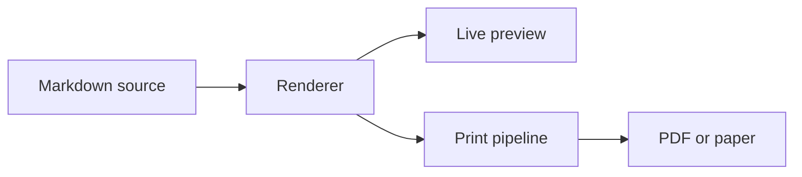

# Welcome to MDPrintView

This is a sample document. Open it in **Split mode** (`⌥⌘2`) to see the source and preview together, or **Preview only** (`⌥⌘3`) to read it cleanly. Try printing it (`⌘P`) to see why "print-quality" is in the name.

## What this document demonstrates

Every feature MDPrintView has, in one place.

### Typography that takes printing seriously

Headings, body text, and code all use print-tuned line height and spacing. Tables stay together. Code blocks don't break across pages. Headings stick with the paragraph that follows them.

> Block quotes get a clean left border and slightly muted text. They are styled identically on screen and on paper.

### Code with syntax color

```swift
import SwiftUI

struct ContentView: View {
    @State private var text = ""

    var body: some View {
        TextEditor(text: $text)
            .font(.body.monospaced())
            .padding()
    }
}
```

```python
def fibonacci(n: int) -> int:
    if n <= 1:
        return n
    return fibonacci(n - 1) + fibonacci(n - 2)

print([fibonacci(i) for i in range(10)])
```

### Diagrams via Mermaid

Fenced blocks tagged with `mermaid` render inline in the preview and in print.



### Math via LaTeX

Display math centers and gets its own line:

$$
e^{i\pi} + 1 = 0
$$

Inline math like \(\sigma = \sqrt{\frac{1}{N}\sum_{i=1}^N (x_i - \mu)^2}\) flows naturally in the paragraph.

### Tables that survive page breaks

| Shortcut | Action |
|---|---|
| `⌘N` / `⌘O` | New / Open document |
| `⌘B` / `⌘I` | Bold / Italic |
| `⌘1` `⌘2` `⌘3` | Heading 1 / 2 / 3 |
| `⌘K` | Insert link |
| `⌘⇧M` | Mermaid editor |
| `⌘P` / `⌘⇧E` | Print preview / Export PDF |
| `⌥⌘1` `⌥⌘2` `⌥⌘3` | Editor / Split / Preview only |
| `⌘,` | Settings |

### Lists and emphasis

- **Bold**, *italic*, ~~strikethrough~~, `inline code`.
- Numbered lists too:
  1. First item
  2. Second item, with a [link to the repo](https://github.com/neomavkda3/MDPrintView)
  3. Third item with `inline code`
- Task lists:
  - [x] Open MDPrintView
  - [x] Read this far
  - [ ] Try every layout mode

### Live external-edit reload

Edit this file in another tool (vim, Claude Code, VS Code) and MDPrintView updates in place. No manual reload, no version-mismatch dialogs.

## Privacy by design

Zero network access. Nothing leaves your Mac. The preview pane is a sandboxed WebView with bundled JavaScript for Mermaid and KaTeX rendering. No telemetry, no analytics. The only network call MDPrintView ever makes is the daily Sparkle check for new versions.

## Open source

MDPrintView is free under GPL-3.0. Source at [github.com/neomavkda3/MDPrintView](https://github.com/neomavkda3/MDPrintView). Sponsorship on GitHub funds laptops, software subscriptions, training, and AI/cloud credits for new graduates entering sports tech, through [ANCOP Canada](https://www.ancopcanada.org/).

---

Try the layout modes, switch themes via Settings (`⌘,`), take a screenshot of your favorite combination. You're using MDPrintView right now.
