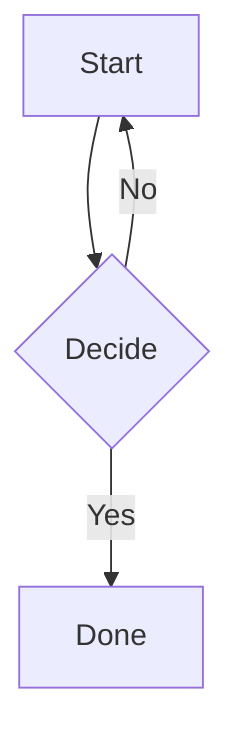

# MDPrintView Week 4 Implementation Plan

> **For Claude:** REQUIRED SUB-SKILL: Use superpowers:executing-plans (or subagent-driven-development for same-session) to execute this plan task-by-task.

**Goal:** Add Mermaid diagram rendering, LaTeX math rendering, Settings scene, and accessibility pass — bringing MDPrintView to feature-complete for release prep in Week 5.

**Architecture:** Bundle Mermaid + KaTeX as local JS/CSS assets (no remote loads — preserves the CSP `default-src 'none'` posture). Preview-side rendering happens after the SetBody DOM swap. Editor-side mermaid UX detects the cursor inside a fenced ` ```mermaid ` block via swift-markdown parsing, exposes an "Edit Diagram" command, opens a modal split-pane sheet (NSTextView source + WKWebView live render). Settings scene uses `@AppStorage`-backed `AppSettings` for font size, theme, page size. Accessibility pass adds VoiceOver labels, outline navigation, and dynamic-type-aware font scaling.

**Tech Stack:**
- Swift 6 strict concurrency, SwiftUI on macOS 26
- Mermaid 11.x (`mermaid.min.js` bundled)
- KaTeX 0.16.x (`katex.min.js` + `katex.min.css` bundled)
- `swift-markdown` for code-block detection
- SwiftUI `Settings` scene with `@AppStorage`
- AppKit `NSAccessibility` for accessibility identifiers
- macOS 26 dynamic type APIs

**Reference docs:**
- Design: `docs/plans/2026-06-01-MDPrintView-design.md`
- Week 1 plan Week 4 outline: `docs/plans/2026-06-01-MDPrintView-implementation.md` (lines ~660-700)
- Hybrid mode decision: `docs/plans/2026-06-05-hybrid-mode-decision.md`
- Current commit: `8b68503`

**Axiom skills to invoke at each phase** (load via `Skill` tool before starting):
- Phase A (Mermaid): no skill — vanilla JS interop in `WKWebView`
- Phase B (KaTeX): same
- Phase C (editor sheet): `axiom-swiftui-architecture` for the modal sheet pattern
- Phase D (Settings): `axiom-app-composition` for Settings scene
- Phase E (accessibility): `axiom-ios-accessibility` (macOS patterns largely overlap)

---

## Phasing overview

| Phase | Theme | Tasks | Risk |
|---|---|---|---|
| **A** | Mermaid in preview | A1, A2 | medium (CSP interaction) |
| **B** | KaTeX in preview | B1, B2 | low |
| **C** | Mermaid editing UX | C1, C2 | medium |
| **D** | Settings | D1, D2 | low |
| **E** | Accessibility pass | E1, E2 | low |

9 tasks. ~1 week of focused part-time work.

### Scope decisions vs. original brainstorm

- **In-margin live mermaid overlay → DEFERRED to v1.1.** The Section D design called for a Liquid Glass overlay positioned next to the cursor's fenced block. Implementing precise NSTextView range-to-frame conversion + glass overlay positioning + scroll tracking is its own multi-day spike. Week 4 ships a simpler pattern: a toolbar/keyboard-invoked "Edit Diagram" command that opens a modal sheet. The functional outcome (visually editing mermaid with live preview) is delivered.
- **KaTeX in the editor → NOT SHIPPED.** Math rendering happens only in the preview pane. The editor shows raw `$...$` source. Same reasoning as Mermaid: in-editor math rendering is v1.1 polish.

---

## Phase A — Mermaid in preview

### Task A1: Bundle Mermaid + render code blocks

**Files:**
- Create: `MDPrintView/Preview/Resources/mermaid.min.js` (downloaded)
- Modify: `MDPrintView/Preview/Resources/preview.html`
- Modify: `MDPrintView/Preview/PreviewWebView.swift`
- Modify: `MDPrintView/Preview/Resources/preview.css`

**Step 1: Bundle Mermaid JS as a resource**

Download `mermaid.min.js` (v11.x, latest stable) from the mermaid-js project's npm CDN to the resource directory. Verify SHA-256 (record in `docs/plans/2026-06-06-vendored-assets.md`).

Bash:
```bash
curl -fSL "https://cdn.jsdelivr.net/npm/mermaid@11/dist/mermaid.min.js" \
  -o ~/MDPrintView/MDPrintView/Preview/Resources/mermaid.min.js
shasum -a 256 ~/MDPrintView/MDPrintView/Preview/Resources/mermaid.min.js
ls -lh ~/MDPrintView/MDPrintView/Preview/Resources/mermaid.min.js
```

Expect: file is in the ~2.5MB range. Capture SHA-256 to the vendored-assets doc.

**Step 2: Update preview.html to load Mermaid + add render container hook**

Replace `MDPrintView/Preview/Resources/preview.html`:

```html
<!DOCTYPE html>
<html>
<head>
    <meta charset="utf-8">
    <meta http-equiv="Content-Security-Policy" content="default-src 'none'; style-src 'self' 'unsafe-inline'; script-src 'self' 'unsafe-inline'; img-src 'self' data:;">
    <title>MDPrintView preview</title>
    <link rel="stylesheet" href="preview.css">
    <script src="mermaid.min.js"></script>
</head>
<body class="screen">
    <main id="content"></main>
</body>
</html>
```

Three CSP changes from W1 (NECESSARY for Mermaid):
1. `script-src 'self' 'unsafe-inline'` — Mermaid generates inline `<style>` and `<script>` elements when rendering diagrams.
2. `img-src 'self' data:` — Mermaid SVG output uses inline data URLs for some icons.

Document why in a CSS comment near the meta tag.

**Step 3: Modify `PreviewWebView.inject` to invoke Mermaid after setBody**

In `MDPrintView/Preview/PreviewWebView.swift`, update the `inject` static func to call Mermaid after content swap:

```swift
fileprivate static func inject(html: String, mode: PreviewMode, into webView: WKWebView) {
    let escaped = escape(html)
    let cls = mode.rawValue
    let js = """
    document.body.className = '\(cls)';
    document.getElementById('content').innerHTML = `\(escaped)`;
    if (window.mermaid) {
        try {
            window.mermaid.initialize({ startOnLoad: false, securityLevel: 'strict', theme: document.body.classList.contains('dark') ? 'dark' : 'default' });
            window.mermaid.run({ querySelector: 'code.language-mermaid' });
        } catch(e) {
            console.error('Mermaid render failed:', e);
        }
    }
    """
    webView.evaluateJavaScript(js)
}
```

Note: Mermaid expects `<pre><code class="language-mermaid">...</code></pre>` from a typical markdown renderer. Our renderer currently emits `<pre><code>` without language class. **Update `MarkdownRenderer.HTMLEmitter.visitCodeBlock`** to include the language class when present:

In `MDPrintView/Rendering/MarkdownRenderer.swift`, modify `visitCodeBlock`:

```swift
mutating func visitCodeBlock(_ codeBlock: CodeBlock) {
    let escapedCode = htmlEscape(codeBlock.code)
    if let lang = codeBlock.language, !lang.isEmpty {
        let escapedLang = htmlEscape(lang)
        output += "<pre><code class=\"language-\(escapedLang)\">\(escapedCode)</code></pre>"
    } else {
        output += "<pre><code>\(escapedCode)</code></pre>"
    }
}
```

**Step 4: Add Mermaid-specific CSS**

Append to `preview.css`:

```css
/* Mermaid containers */
code.language-mermaid {
    display: block;
}
.mermaid {
    text-align: center;
    background: transparent;
    padding: 1em 0;
}
```

**Step 5: Update tests for the new code-block class behavior**

Modify the renderer test for code blocks. In `MDPrintViewTests/MarkdownRendererTests.swift`, find `rendersCodeBlock` and add a new test:

```swift
@Test("code block with language gets class attribute")
func rendersCodeBlockWithLanguage() {
    let html = MarkdownRenderer().renderHTML(from: "```swift\nlet x = 1\n```")
    #expect(html.contains("<code class=\"language-swift\">"))
    #expect(html.contains("let x = 1"))
}

@Test("mermaid code block gets language-mermaid class")
func rendersMermaidBlock() {
    let html = MarkdownRenderer().renderHTML(from: "```mermaid\ngraph TD\n  A --> B\n```")
    #expect(html.contains("<code class=\"language-mermaid\">"))
}
```

Run tests:
```
cd ~/MDPrintView
xcodegen generate
xcodebuild -project MDPrintView.xcodeproj -scheme MDPrintView -destination 'platform=macOS' -configuration Debug test 2>&1 | tail -5
```

Expected: TEST SUCCEEDED with 48 tests (46 prior + 2 new).

**Step 6: Smoke test mermaid actually renders in the app**

Build and open a test doc:
```bash
cat > /tmp/mermaid-test.md <<'EOF'
# Mermaid Smoke Test

Some text.



More text.
EOF

APP_PATH=$(find ~/Library/Developer/Xcode/DerivedData -name 'MDPrintView.app' -path '*Debug*' -type d -print -quit)
pkill -x MDPrintView 2>/dev/null; sleep 1
open "$APP_PATH" /tmp/mermaid-test.md
sleep 6
pgrep -lf 'MDPrintView.app/Contents/MacOS/MDPrintView' >/dev/null && echo "ALIVE" || echo "DEAD"
osascript -e 'tell application "MDPrintView" to quit' 2>/dev/null
pkill -x MDPrintView 2>/dev/null
rm -f /tmp/mermaid-test.md
```

Expected: ALIVE; no new crash report. Visual verification (user only): the right pane shows an actual flowchart SVG, not the raw `graph TD` text.

**Step 7: Commit**

```
git add MDPrintView/Preview/Resources/mermaid.min.js MDPrintView/Preview/Resources/preview.html MDPrintView/Preview/Resources/preview.css MDPrintView/Preview/PreviewWebView.swift MDPrintView/Rendering/MarkdownRenderer.swift MDPrintViewTests/MarkdownRendererTests.swift MDPrintView.xcodeproj/project.pbxproj
git commit -m "feat: bundle Mermaid 11.x — fenced \`mermaid\` blocks render as diagrams"
```

---

### Task A2: Mermaid vendored asset documentation

**Files:**
- Create: `docs/plans/2026-06-06-vendored-assets.md`

**Step 1: Document the vendored asset**

Create with the SHA-256 from Task A1, source URL, version, license note:

```markdown
# Vendored Assets

Third-party assets bundled into the app for offline / sandbox-safe operation. Each entry records source, version, hash, and license.

## mermaid.min.js

- Source: https://cdn.jsdelivr.net/npm/mermaid@11/dist/mermaid.min.js
- Version: 11.x (vendored 2026-06-06)
- SHA-256: <paste from A1 step 1>
- License: MIT
- Bundled at: `MDPrintView/Preview/Resources/mermaid.min.js`
- Why bundled: CSP `script-src 'self'` prohibits remote scripts. App is sandboxed (no network entitlement in v1).
- Update procedure: re-run the curl in A1 step 1, update hash in this file, smoke test renders.
```

**Step 2: Commit**

```
git add docs/plans/2026-06-06-vendored-assets.md
git commit -m "docs: record vendored Mermaid asset (source, version, SHA-256, license)"
```

---

## Phase B — KaTeX in preview

### Task B1: Bundle KaTeX + render inline + block math

**Files:**
- Create: `MDPrintView/Preview/Resources/katex.min.js`
- Create: `MDPrintView/Preview/Resources/katex.min.css`
- Create: `MDPrintView/Preview/Resources/auto-render.min.js`
- Modify: `MDPrintView/Preview/Resources/preview.html`
- Modify: `MDPrintView/Preview/PreviewWebView.swift`
- Modify: `MDPrintView/Preview/Resources/preview.css`
- Modify: `docs/plans/2026-06-06-vendored-assets.md`

**Step 1: Bundle KaTeX**

```bash
curl -fSL "https://cdn.jsdelivr.net/npm/katex@0.16/dist/katex.min.js" \
  -o ~/MDPrintView/MDPrintView/Preview/Resources/katex.min.js
curl -fSL "https://cdn.jsdelivr.net/npm/katex@0.16/dist/katex.min.css" \
  -o ~/MDPrintView/MDPrintView/Preview/Resources/katex.min.css
curl -fSL "https://cdn.jsdelivr.net/npm/katex@0.16/dist/contrib/auto-render.min.js" \
  -o ~/MDPrintView/MDPrintView/Preview/Resources/auto-render.min.js
shasum -a 256 ~/MDPrintView/MDPrintView/Preview/Resources/katex.min.{js,css}
shasum -a 256 ~/MDPrintView/MDPrintView/Preview/Resources/auto-render.min.js
```

Append the three hashes to `2026-06-06-vendored-assets.md`.

**Note on fonts:** KaTeX's CSS references woff2 font files via relative URLs (`fonts/KaTeX_Main-Regular.woff2` etc.). For v1 we accept fallback to system fonts (KaTeX renders with system-fallback metrics — slightly degraded but functional). Bundling the woff2 fonts is a v1.1 polish.

**Step 2: Update preview.html**

```html
<!DOCTYPE html>
<html>
<head>
    <meta charset="utf-8">
    <meta http-equiv="Content-Security-Policy" content="default-src 'none'; style-src 'self' 'unsafe-inline'; script-src 'self' 'unsafe-inline'; img-src 'self' data:; font-src 'self' data:;">
    <title>MDPrintView preview</title>
    <link rel="stylesheet" href="preview.css">
    <link rel="stylesheet" href="katex.min.css">
    <script src="mermaid.min.js"></script>
    <script src="katex.min.js"></script>
    <script src="auto-render.min.js"></script>
</head>
<body class="screen">
    <main id="content"></main>
</body>
</html>
```

Added: `font-src 'self' data:` for KaTeX font fallback.

**Step 3: Invoke KaTeX auto-render after setBody**

Update `PreviewWebView.inject`:

```swift
fileprivate static func inject(html: String, mode: PreviewMode, into webView: WKWebView) {
    let escaped = escape(html)
    let cls = mode.rawValue
    let js = """
    document.body.className = '\(cls)';
    document.getElementById('content').innerHTML = `\(escaped)`;
    if (window.renderMathInElement) {
        try {
            window.renderMathInElement(document.getElementById('content'), {
                delimiters: [
                    { left: '$$', right: '$$', display: true },
                    { left: '$', right: '$', display: false },
                    { left: '\\\\(', right: '\\\\)', display: false },
                    { left: '\\\\[', right: '\\\\]', display: true }
                ],
                throwOnError: false
            });
        } catch(e) { console.error('KaTeX render failed:', e); }
    }
    if (window.mermaid) {
        try {
            window.mermaid.initialize({ startOnLoad: false, securityLevel: 'strict', theme: document.body.classList.contains('dark') ? 'dark' : 'default' });
            window.mermaid.run({ querySelector: 'code.language-mermaid' });
        } catch(e) { console.error('Mermaid render failed:', e); }
    }
    """
    webView.evaluateJavaScript(js)
}
```

Important: KaTeX MUST run BEFORE Mermaid, otherwise it tries to parse the SVG output as TeX.

**Step 4: Smoke test math rendering**

```bash
cat > /tmp/math-test.md <<'EOF'
# Math Test

Inline math: $E = mc^2$ — Einstein.

Block math:

$$\int_{0}^{\infty} e^{-x^2} dx = \frac{\sqrt{\pi}}{2}$$

Done.
EOF

APP_PATH=$(find ~/Library/Developer/Xcode/DerivedData -name 'MDPrintView.app' -path '*Debug*' -type d -print -quit)
pkill -x MDPrintView 2>/dev/null; sleep 1
open "$APP_PATH" /tmp/math-test.md
sleep 6
pgrep -lf 'MDPrintView.app/Contents/MacOS/MDPrintView' >/dev/null && echo "ALIVE" || echo "DEAD"
osascript -e 'tell application "MDPrintView" to quit' 2>/dev/null
pkill -x MDPrintView 2>/dev/null
rm -f /tmp/math-test.md
```

Expected: ALIVE. Visual (user only): inline `E = mc^2` renders with italic E, italicized m, c with superscript 2. Block integral renders centered with proper notation.

**Step 5: Commit**

```
git add MDPrintView/Preview/Resources/katex.min.js MDPrintView/Preview/Resources/katex.min.css MDPrintView/Preview/Resources/auto-render.min.js MDPrintView/Preview/Resources/preview.html MDPrintView/Preview/PreviewWebView.swift docs/plans/2026-06-06-vendored-assets.md MDPrintView.xcodeproj/project.pbxproj
git commit -m "feat: bundle KaTeX — \$inline\$ and \$\$block\$\$ math render"
```

---

### Task B2: Renderer integration test (Swift-side)

**Why:** Pure Swift verification that `$` delimiter content survives our HTML escaping (so KaTeX can find it on the JS side).

**Files:**
- Modify: `MDPrintViewTests/MarkdownRendererTests.swift`

**Step 1: Add test**

Inside the `MarkdownRendererTests` suite:

```swift
@Test("preserves math delimiters in output (KaTeX scans this)")
func preservesMathDelimiters() {
    let inline = MarkdownRenderer().renderHTML(from: "Some $x = 1$ math.")
    #expect(inline.contains("$x = 1$"))

    let block = MarkdownRenderer().renderHTML(from: "$$x = 1$$")
    #expect(block.contains("$$x = 1$$"))
}
```

This verifies our escape function doesn't mangle `$`. (htmlEscape doesn't escape `$`, so this should pass on the existing implementation — the test is documentation + regression coverage.)

**Step 2: Run + commit**

```
xcodebuild ... test 2>&1 | tail -5
```

Expected: 49 tests pass (48 + 1 new).

```
git add MDPrintViewTests/MarkdownRendererTests.swift
git commit -m "test: math delimiters survive renderer escape pass"
```

---

## Phase C — Mermaid editing UX

### Task C1: Mermaid block detection helper + tests

**Why:** Need a pure function to answer "is the cursor at offset N inside a fenced ` ```mermaid ` block, and if so what's the source?" — used by C2 for the modal sheet.

**Files:**
- Create: `MDPrintView/Editor/MermaidBlock.swift`
- Test: `MDPrintViewTests/MermaidBlockTests.swift`

**Step 1: Failing tests**

```swift
import Testing
@testable import MDPrintView

@Suite("MermaidBlock")
struct MermaidBlockTests {

    @Test("finds mermaid block containing cursor")
    func findsBlockAtCursor() {
        let source = "intro\n\n```mermaid\ngraph TD\n  A --> B\n```\n\nafter\n"
        // Cursor inside the diagram source
        let cursor = source.range(of: "graph")!.lowerBound.utf16Offset(in: source)
        let block = MermaidBlock.containing(cursor: cursor, in: source)
        #expect(block != nil)
        #expect(block?.code.contains("graph TD") == true)
    }

    @Test("returns nil when cursor outside any mermaid block")
    func nilOutsideAnyBlock() {
        let source = "intro\n\n```mermaid\nx\n```\n\nafter\n"
        let cursor = source.range(of: "after")!.lowerBound.utf16Offset(in: source)
        let block = MermaidBlock.containing(cursor: cursor, in: source)
        #expect(block == nil)
    }

    @Test("returns nil when cursor inside non-mermaid code block")
    func nilInsideOtherLanguage() {
        let source = "```swift\nlet x = 1\n```\n"
        let cursor = source.range(of: "let")!.lowerBound.utf16Offset(in: source)
        let block = MermaidBlock.containing(cursor: cursor, in: source)
        #expect(block == nil)
    }

    @Test("reports the NSRange of the entire mermaid block including fences")
    func reportsRangeIncludingFences() {
        let source = "before\n```mermaid\nx\n```\nafter"
        let cursor = source.range(of: "x")!.lowerBound.utf16Offset(in: source)
        let block = MermaidBlock.containing(cursor: cursor, in: source)
        let range = block!.fullRange
        let nsString = source as NSString
        let extracted = nsString.substring(with: range)
        #expect(extracted.hasPrefix("```mermaid"))
        #expect(extracted.hasSuffix("```"))
    }
}
```

**Step 2: Confirm RED**

```
xcodegen generate
xcodebuild ... test 2>&1 | grep -E "(cannot find|error:)" | head -5
```

Expected: `cannot find 'MermaidBlock' in scope`.

Commit RED:
```
git add MDPrintViewTests/MermaidBlockTests.swift MDPrintView.xcodeproj/project.pbxproj
git commit -m "test(red): MermaidBlock cursor-containment lookup"
```

**Step 3: Implement**

Create `MDPrintView/Editor/MermaidBlock.swift`:

```swift
import Foundation
import Markdown

struct MermaidBlock {
    let code: String
    let fullRange: NSRange // includes fences

    static func containing(cursor: Int, in source: String) -> MermaidBlock? {
        let document = Document(parsing: source)
        var found: MermaidBlock?
        for node in document.children {
            guard let block = node as? CodeBlock,
                  block.language == "mermaid",
                  let range = nsRange(for: block, in: source) else { continue }
            if cursor >= range.location && cursor <= range.location + range.length {
                found = MermaidBlock(code: block.code, fullRange: range)
                break
            }
        }
        return found
    }

    private static func nsRange(for markup: Markup, in source: String) -> NSRange? {
        guard let range = markup.range else { return nil }
        let start = offset(for: range.lowerBound, in: source)
        let end = offset(for: range.upperBound, in: source)
        guard start >= 0, end >= start else { return nil }
        return NSRange(location: start, length: end - start)
    }

    private static func offset(for location: SourceLocation, in source: String) -> Int {
        let lines = source.components(separatedBy: "\n")
        var offset = 0
        let targetLine = max(1, location.line)
        for (i, line) in lines.enumerated() {
            if i + 1 == targetLine {
                let col = max(1, location.column) - 1
                let lineLength = (line as NSString).length
                return offset + min(col, lineLength)
            }
            offset += (line as NSString).length + 1
        }
        return offset
    }
}
```

**Step 4: Confirm GREEN**

```
xcodebuild ... test 2>&1 | tail -5
```

Expected: 53 tests pass (49 + 4 new).

**Step 5: Commit GREEN**

```
git add MDPrintView/Editor/MermaidBlock.swift MDPrintView.xcodeproj/project.pbxproj
git commit -m "feat(green): MermaidBlock detects fenced \`mermaid\` containing cursor"
```

---

### Task C2: Modal mermaid editor sheet

**Files:**
- Create: `MDPrintView/Editor/MermaidEditorSheet.swift`
- Modify: `MDPrintView/Editor/EditorController.swift`
- Modify: `MDPrintView/Views/DocumentView.swift`
- Modify: `MDPrintView/MDPrintViewApp.swift`

**Step 1: Sheet view**

Create `MDPrintView/Editor/MermaidEditorSheet.swift`:

```swift
import SwiftUI
import WebKit

struct MermaidEditorSheet: View {
    @Binding var source: String
    let onApply: (String) -> Void
    let onCancel: () -> Void

    @State private var draft: String

    init(source: Binding<String>, onApply: @escaping (String) -> Void, onCancel: @escaping () -> Void) {
        self._source = source
        self.onApply = onApply
        self.onCancel = onCancel
        self._draft = State(initialValue: source.wrappedValue)
    }

    var body: some View {
        VStack(spacing: 0) {
            HStack {
                Text("Edit Mermaid Diagram").font(.headline)
                Spacer()
            }
            .padding()

            HSplitView {
                MermaidSourceView(text: $draft)
                    .frame(minWidth: 280)

                MermaidLivePreview(source: draft)
                    .frame(minWidth: 280)
            }
            .frame(minHeight: 360)

            HStack {
                Spacer()
                Button("Cancel", role: .cancel) { onCancel() }
                    .keyboardShortcut(.escape)
                Button("Apply") {
                    onApply(draft)
                }
                .keyboardShortcut(.return)
                .buttonStyle(.borderedProminent)
            }
            .padding()
        }
        .frame(minWidth: 720, minHeight: 480)
    }
}

private struct MermaidSourceView: NSViewRepresentable {
    @Binding var text: String

    func makeCoordinator() -> Coordinator { Coordinator(text: $text) }

    func makeNSView(context: Context) -> NSScrollView {
        let scroll = NSTextView.scrollableTextView()
        guard let tv = scroll.documentView as? NSTextView else { return scroll }
        tv.delegate = context.coordinator
        tv.isRichText = false
        tv.font = .monospacedSystemFont(ofSize: 13, weight: .regular)
        tv.textContainerInset = NSSize(width: 10, height: 10)
        tv.string = text
        return scroll
    }

    func updateNSView(_ scroll: NSScrollView, context: Context) {
        guard let tv = scroll.documentView as? NSTextView else { return }
        if tv.string != text { tv.string = text }
    }

    @MainActor
    final class Coordinator: NSObject, NSTextViewDelegate {
        let text: Binding<String>
        init(text: Binding<String>) { self.text = text }
        func textDidChange(_ notification: Notification) {
            guard let tv = notification.object as? NSTextView else { return }
            text.wrappedValue = tv.string
        }
    }
}

private struct MermaidLivePreview: NSViewRepresentable {
    let source: String

    func makeNSView(context: Context) -> WKWebView {
        let config = WKWebViewConfiguration()
        config.preferences.javaScriptCanOpenWindowsAutomatically = false
        let webView = WKWebView(frame: .zero, configuration: config)
        webView.setValue(false, forKey: "drawsBackground")
        loadTemplate(into: webView)
        return webView
    }

    func updateNSView(_ webView: WKWebView, context: Context) {
        render(source, into: webView)
    }

    private func loadTemplate(into webView: WKWebView) {
        guard let url = Bundle.main.url(forResource: "preview", withExtension: "html") else { return }
        webView.loadFileURL(url, allowingReadAccessTo: url.deletingLastPathComponent())
    }

    private func render(_ source: String, into webView: WKWebView) {
        let escaped = source
            .replacingOccurrences(of: "\\", with: "\\\\")
            .replacingOccurrences(of: "`", with: "\\`")
            .replacingOccurrences(of: "$", with: "\\$")
        let js = """
        document.getElementById('content').innerHTML = '<pre><code class="language-mermaid">' + `\(escaped)`.replace(/&/g, '&amp;').replace(/</g, '&lt;').replace(/>/g, '&gt;') + '</code></pre>';
        if (window.mermaid) {
            try {
                window.mermaid.initialize({ startOnLoad: false, securityLevel: 'strict' });
                window.mermaid.run({ querySelector: 'code.language-mermaid' });
            } catch(e) { console.error(e); }
        }
        """
        webView.evaluateJavaScript(js)
    }
}
```

**Step 2: Wire into EditorController + DocumentView**

In `EditorController.swift`, add an Observable property + method to launch the sheet:

```swift
@MainActor
@Observable
final class EditorController {
    weak var textView: NSTextView?
    var editingMermaidBlock: MermaidBlock?
    // ...existing properties...

    func openMermaidEditor() {
        guard let textView, let storage = textView.textStorage else { return }
        let source = storage.string
        let cursor = textView.selectedRange().location
        guard let block = MermaidBlock.containing(cursor: cursor, in: source) else {
            // If cursor isn't in a mermaid block, insert a new one first
            insertMermaid()
            return
        }
        editingMermaidBlock = block
    }

    func applyMermaidEdit(_ newCode: String) {
        guard let textView, let storage = textView.textStorage, let block = editingMermaidBlock else { return }
        let replacement = "```mermaid\n\(newCode)\n```"
        storage.replaceCharacters(in: block.fullRange, with: replacement)
        textView.didChangeText()
        editingMermaidBlock = nil
    }

    func cancelMermaidEdit() {
        editingMermaidBlock = nil
    }
    // ...rest unchanged...
}
```

In `DocumentView.swift`, observe `editor.editingMermaidBlock` and present a sheet:

```swift
// inside DocumentView's body, append:
.sheet(item: Binding(
    get: { editor.editingMermaidBlock },
    set: { editor.editingMermaidBlock = $0 }
)) { block in
    let sourceBinding = Binding(
        get: { block.code },
        set: { _ in } // sheet manages its own draft
    )
    MermaidEditorSheet(
        source: sourceBinding,
        onApply: { newCode in editor.applyMermaidEdit(newCode) },
        onCancel: { editor.cancelMermaidEdit() }
    )
}
```

Make `MermaidBlock` conform to `Identifiable` (use `fullRange.location` as id):

In `MermaidBlock.swift` add:
```swift
extension MermaidBlock: Identifiable {
    var id: Int { fullRange.location }
}
```

**Step 3: Hook Cmd+Shift+M to `openMermaidEditor`**

The toolbar already has Cmd+Shift+M wired to `insertMermaid()` from W2. Change it to `openMermaidEditor()` — which inserts AND opens the sheet if no existing block at cursor.

In `EditorToolbar.swift`:
```swift
Button { controller.openMermaidEditor() } label: { Image(systemName: "chart.xyaxis.line") }
    .keyboardShortcut("m", modifiers: [.command, .shift])
    .help("Mermaid diagram")
```

**Step 4: Build, smoke test the sheet**

```
xcodegen generate
xcodebuild ... build 2>&1 | tail -5
```

Manual smoke:
1. Open a doc with no mermaid block, press Cmd+Shift+M → inserts ` ```mermaid ` skeleton AND opens sheet
2. Open a doc with cursor inside an existing mermaid block, press Cmd+Shift+M → opens sheet with existing source
3. Edit in left pane → right pane re-renders within 250ms
4. Apply → main editor updates with new source
5. Cancel → sheet dismisses, main editor unchanged

**Step 5: Commit**

```
git add MDPrintView/Editor/MermaidEditorSheet.swift MDPrintView/Editor/EditorController.swift MDPrintView/Editor/MermaidBlock.swift MDPrintView/Editor/EditorToolbar.swift MDPrintView/Views/DocumentView.swift MDPrintView.xcodeproj/project.pbxproj
git commit -m "feat: Cmd+Shift+M opens modal Mermaid editor (split-pane source + live preview)"
```

---

## Phase D — Settings

### Task D1: AppSettings + Settings scene

**Files:**
- Create: `MDPrintView/Models/AppSettings.swift`
- Modify: `MDPrintView/MDPrintViewApp.swift`

**Step 1: AppSettings**

```swift
import SwiftUI

@MainActor
@Observable
final class AppSettings {
    @ObservationIgnored
    @AppStorage("editorFontSize") private var storedEditorFontSize: Double = 14

    var editorFontSize: Double {
        get { storedEditorFontSize }
        set { storedEditorFontSize = newValue }
    }

    @ObservationIgnored
    @AppStorage("defaultPageSize") private var storedPageSize: String = "letter"

    var defaultPageSize: PageSize {
        get { PageSize(rawValue: storedPageSize) ?? .letter }
        set { storedPageSize = newValue.rawValue }
    }

    enum PageSize: String, CaseIterable, Identifiable {
        case letter
        case a4
        var id: String { rawValue }
        var label: String { self == .letter ? "US Letter" : "A4" }
    }
}
```

**Step 2: Settings scene**

```swift
// In MDPrintViewApp.swift, add a Settings scene alongside DocumentGroup:

@main
struct MDPrintViewApp: App {
    @State private var settings = AppSettings()

    var body: some Scene {
        DocumentGroup(newDocument: { MarkdownDocument() }) { file in
            DocumentView(document: file.document)
                .environment(settings)
        }
        .commands {
            CommandGroup(replacing: .printItem) {
                PrintMenuItem()
                ExportPDFMenuItem()
            }
        }

        Settings {
            SettingsView()
                .environment(settings)
        }
    }
}

private struct SettingsView: View {
    @Environment(AppSettings.self) private var settings

    var body: some View {
        @Bindable var settings = settings

        Form {
            Section("Editor") {
                HStack {
                    Text("Font size")
                    Slider(value: $settings.editorFontSize, in: 10...24, step: 1)
                    Text("\(Int(settings.editorFontSize)) pt")
                        .monospacedDigit()
                        .frame(width: 50, alignment: .trailing)
                }
            }
            Section("Print") {
                Picker("Page size", selection: $settings.defaultPageSize) {
                    ForEach(AppSettings.PageSize.allCases) { Text($0.label).tag($0) }
                }
            }
        }
        .padding()
        .frame(width: 440, height: 260)
    }
}
```

**Step 3: Build, smoke**

```
xcodegen generate
xcodebuild ... build 2>&1 | tail -3
```

Manual: open app, press Cmd+, → Settings window opens with Font size slider + Page size picker. Adjust values; close and reopen the app → values persist via UserDefaults.

**Step 4: Commit**

```
git add MDPrintView/Models/AppSettings.swift MDPrintView/MDPrintViewApp.swift MDPrintView.xcodeproj/project.pbxproj
git commit -m "feat: AppSettings + Cmd+, Settings scene (font size, page size)"
```

---

### Task D2: Wire font size into the source editor

**Files:**
- Modify: `MDPrintView/Editor/SyntaxHighlighter.swift`
- Modify: `MDPrintView/Editor/MarkdownTextView.swift`

**Step 1: Make SyntaxHighlighter accept a base size**

```swift
@MainActor
struct SyntaxHighlighter {
    let baseFontSize: CGFloat

    init(baseFontSize: CGFloat = 14) {
        self.baseFontSize = baseFontSize
    }
    // ...rest of file: use self.baseFontSize where 14 was hardcoded...
}
```

Compute `headingSizes` proportional to base — h1 = base + 8, h2 = base + 5, h3 = base + 3, h4 = base + 1, h5/h6 = base. (Adjust the existing hardcoded array.)

**Step 2: Inject base size from settings via MarkdownTextView**

In `MarkdownTextView`, accept an `editorFontSize: CGFloat` parameter; pass to the Coordinator. In `applyStyling`, construct the highlighter with that base size:

```swift
struct MarkdownTextView: NSViewRepresentable {
    @Binding var text: String
    let controller: EditorController
    let mode: EditorMode
    let editorFontSize: CGFloat
    // ...
}
```

In `DocumentView`, read from environment:

```swift
struct DocumentView: View {
    @Environment(AppSettings.self) private var settings
    // ...
    MarkdownTextView(text: $document.text, controller: editor, mode: editorMode, editorFontSize: CGFloat(settings.editorFontSize))
}
```

**Step 3: Build + tests**

The existing SyntaxHighlighter tests assume 14pt. They should still pass because the default init uses 14. New tests for the size injection:

```swift
@Test("custom base size scales heading sizes")
func customBaseSize() {
    let storage = NSTextStorage(string: "# Heading\n")
    SyntaxHighlighter(baseFontSize: 16).apply(to: storage)
    let attrs = storage.attributes(at: 0, effectiveRange: nil)
    let font = attrs[.font] as? NSFont
    #expect((font?.pointSize ?? 0) >= 20) // h1 at base 16 should be 24
}
```

```
xcodebuild ... test 2>&1 | tail -5
```

Expected: 54 tests pass (53 + 1 new).

**Step 4: Commit**

```
git add MDPrintView/Editor/SyntaxHighlighter.swift MDPrintView/Editor/MarkdownTextView.swift MDPrintView/Views/DocumentView.swift MDPrintViewTests/SyntaxHighlighterTests.swift
git commit -m "feat: editor base font size honors AppSettings (Cmd+, Settings)"
```

---

## Phase E — Accessibility pass

> **Before starting Phase E:** Load `axiom-ios-accessibility` via the Skill tool. macOS accessibility patterns share most of the iOS skill's content.

### Task E1: VoiceOver labels + accessibility identifiers

**Files:**
- Modify: `MDPrintView/Editor/EditorToolbar.swift`
- Modify: `MDPrintView/Views/OutlineSidebar.swift`

**Step 1: Toolbar accessibility**

Every toolbar `Button` already has a `.help(...)` modifier — VoiceOver reads `.help` content as the accessibility label. But explicit `.accessibilityLabel` + `.accessibilityIdentifier` is preferred for tests and clarity. Update each button:

```swift
Button { controller.toggleBold() } label: { Image(systemName: "bold") }
    .keyboardShortcut("b", modifiers: .command)
    .help("Bold")
    .accessibilityLabel("Bold")
    .accessibilityIdentifier("toolbar.bold")
```

Repeat for italic, strikethrough, headings menu, lists, code, link, mermaid, mode picker.

**Step 2: Outline sidebar accessibility**

In `OutlineSidebar.swift`, label each row + the empty state:

```swift
Text(node.title)
    .font(...)
    .lineLimit(2)
    .accessibilityLabel("Heading: \(node.title)")
    .accessibilityHint("Level \(node.level)")
```

**Step 3: Build, smoke**

```
xcodebuild ... build 2>&1 | tail -3
```

(Real VoiceOver verification requires manually enabling VoiceOver via System Settings — record observations in spike notes if you do it.)

**Step 4: Commit**

```
git add MDPrintView/Editor/EditorToolbar.swift MDPrintView/Views/OutlineSidebar.swift
git commit -m "a11y: accessibility labels + identifiers for toolbar and outline"
```

---

### Task E2: Dynamic Type-aware font scaling for the editor (already done by D2)

D2 already gives users editor-font-size control via Settings. That's the manual override. macOS does NOT have automatic Dynamic Type for NSTextView the way iOS does, so the Settings slider IS our Dynamic Type story for v1.

Document this in the spike notes:

**Files:** Create `docs/plans/2026-06-06-week4-notes.md`

```markdown
# Week 4 Notes

## Accessibility — Dynamic Type

macOS does not have automatic Dynamic Type for NSTextView the way iOS does. v1 accessibility for editor font scaling: AppSettings.editorFontSize, exposed via Cmd+, Settings, 10–24pt range.

Future v1.1+ work: support `NSPreferredFontDescriptor.preferredFont(forTextStyle:)` and live-update on system text-size changes via NSWorkspace notifications.

## Accessibility — VoiceOver

All toolbar buttons have `.accessibilityLabel` and `.accessibilityIdentifier`. Outline sidebar rows label headings with level. Editor NSTextView inherits accessibility from AppKit (rotor, item chooser, etc.).

Manual VoiceOver smoke test pending (requires user with VO enabled).

## Color contrast

App relies on system colors (`textColor`, `linkColor`, `secondaryLabelColor`, `tertiaryLabelColor`, `bar` material). These adapt to light/dark and Increased Contrast automatically. Print mode CSS uses pure black on white (WCAG AAA).
```

**Commit:**

```
git add docs/plans/2026-06-06-week4-notes.md
git commit -m "docs: Week 4 accessibility notes (Dynamic Type, VoiceOver, contrast)"
```

---

## Week 4 milestone

After all 9 tasks:
- ✅ Mermaid diagrams render in the preview pane
- ✅ KaTeX math (`$inline$` and `$$block$$`) renders in the preview pane
- ✅ `Cmd+Shift+M` opens a modal Mermaid editor sheet with live preview
- ✅ `Cmd+,` opens Settings (editor font size 10–24pt, page size Letter/A4)
- ✅ Toolbar + outline sidebar fully accessibility-labeled
- ✅ Vendored asset SHA-256s and licenses recorded
- ✅ 54+ tests passing

This is the **feature-complete** milestone for v1. Week 5 is purely submission readiness: privacy manifest, signing, notarization, screenshots, release metadata.

---

## Execution handoff

Plan complete. Two execution options:

**1. Subagent-Driven (this session)** — same pattern as Weeks 1–3.
**2. Parallel Session (separate)** — open new session, `superpowers:executing-plans`.

Recommend **option 1**.
